<div align="center">

# ⚡ ADHI OS v2.0


<p>


</p>

</div>

---

```text
╔══════════════════════════════════════════════════════╗
║                  SYSTEM INITIALIZED                 ║
╠══════════════════════════════════════════════════════╣
║ USER      : Adhithya N                              ║
║ USERNAME  : Adhi426                                 ║
║ ROLE      : Student || Full Stack Developer         ║
║ EDUCATION : B.Tech Information Technology           ║
║ COLLEGE   : V.S.B Engineering College               ║
║ CGPA      : 8.29                                    ║
║ FOCUS     : AI || Full Stack || Security             ║
║ STATUS    : 🟢 Available for Internships            ║
╚══════════════════════════════════════════════════════╝
```

# 👨‍💻 About Me

```yaml
Name      : Adhithya N
Username  : Adhi426
Location  : Kumbakonam, Tamil Nadu
Education : B.Tech Information Technology
Focus     : AI • Full Stack • Cybersecurity
Interests : AI Systems • Computer Vision • Backend
            Agentic AI • Security • Cloud
Goal      : Build intelligent products that solve
            real-world problems
```

I'm an Information Technology student and Full Stack Developer interested in building **AI-powered, secure, and practical software systems**.

My projects range from **AI risk analysis and deepfake detection** to **agentic commerce, cybersecurity, research explainers, and full-stack web applications**.

I enjoy turning ideas into working products and exploring how AI can be combined with modern software engineering.

---

# 🚀 Current Mission

* 🤖 Building practical AI-powered applications
* 🧠 Exploring AI agents and intelligent systems
* 🔐 Developing AI-driven cybersecurity solutions
* 👁️ Exploring Computer Vision and media forensics
* 🌐 Building full-stack web applications
* ⚙️ Learning scalable backend architecture
* ☁️ Exploring cloud deployment
* 📚 Contributing to Open Source
* 💼 Looking for Software Development / AI internships

---

# 🛠 Tech Stack

### 💻 Languages

<p>

</p>

### 🌐 Web & Frameworks

<p>

</p>

### 🗄️ Databases & Backend

<p>

</p>

### 🤖 AI / Development Tools

<p>

</p>

### 🔧 Areas of Interest

```text
Artificial Intelligence
Machine Learning
Computer Vision
Generative AI
Agentic AI
Cybersecurity
Full Stack Development
Backend Architecture
Cloud Technologies
```

---

# 🚀 Featured Projects

## 🏦 SentinelRisk AI — Bank Risk Assistant

> AI-assisted banking risk and fraud investigation system designed to analyze suspicious transactions and provide evidence-based explanations.

### 🔥 Highlights

* Rule-based risk detection
* Transaction velocity analysis
* Off-hours activity detection
* Baseline anomaly detection
* AI-assisted investigation explanations
* Audit-friendly outputs
* Responsible AI guardrails

**Tech**

`Python` `FastAPI` `Gemini` `SQLite` `Machine Learning`

🔗 **Repository:**
https://github.com/Adhi426/bank_risk_assistant

---

## 🛒 Agentic Commerce Gateway

> Security and policy layer for AI agents interacting with payment and commerce systems.

### 🔥 Highlights

* AI-agent transaction validation
* Budget and price validation
* Inventory verification
* Payment gateway integration
* Policy enforcement
* SHA-256 hash-chained audit ledger
* Secure agent spending workflow

**Tech**

`Next.js` `TypeScript` `Razorpay` `Node.js` `AI Agents`

🔗 **Repository:**
https://github.com/Adhi426/agentic-commerce-gateway

---

## 🕵️ Omni Detector — AI Deepfake Detection

> AI-powered media forensics system designed to analyze potentially manipulated images and media.

### 🔥 Highlights

* AI-based media analysis
* Deepfake detection workflow
* Computer Vision
* Vision AI integration
* Web-based interface
* FastAPI backend

**Tech**

`Next.js` `FastAPI` `Python` `Gemini Vision` `Computer Vision`

🔗 **Repository:**
https://github.com/Adhi426/omni_detector

---

## 🧠 BDH Memory Explainer

> Interactive research-oriented visualization exploring fast-weight / Hebbian memory concepts and transformer KV-cache memory.

### 🔥 Highlights

* Interactive AI concepts
* Hebbian fast-weight memory
* Transformer KV-cache comparison
* Mathematical visualization
* Research paper concepts converted into an interactive application

**Tech**

`Next.js` `TypeScript` `React` `AI Research`

🔗 **Repository:**
https://github.com/Adhi426/bdh-memory-explainer

---

## 🛡️ AI Firewall System

> AI-assisted cybersecurity system designed to explore intelligent threat detection and adaptive security.

### 🔥 Highlights

* Threat detection
* AI-assisted security analysis
* Firewall concepts
* Intelligent monitoring
* Cybersecurity experimentation

**Tech**

`Python` `AI` `Cybersecurity`

🔗 **Repository:**
https://github.com/Adhi426/AI-Firewall-System

---

## ⚡ Parallel Text Handling Processor

> Python-based parallel processing system designed to efficiently process and handle large amounts of text.

### 🔥 Highlights

* Parallel processing
* Text processing
* Performance-oriented architecture
* Python concurrency concepts

**Tech**

`Python` `Parallel Processing`

🔗 **Repository:**
https://github.com/Adhi426/PYTHON-PARALLEL-TEXT-HANDLING-PROCESSOR

---

# 🌐 Full Stack Projects

## 💬 VYORA — Social Media Platform

> Full-stack social media platform with authentication, posts, interactions, and social features.

**Tech**

`MongoDB` `Express.js` `React` `Node.js`

🔗 https://github.com/Adhi426/Social_media_platform

---

## 🛍️ NEXORA — E-Commerce Store

> Full-stack e-commerce platform featuring products, authentication, cart and order workflows.

**Tech**

`MongoDB` `Express.js` `React` `Node.js`

🔗 https://github.com/Adhi426/e_commerce_store

---

## 👥 WorkSync — HR Management System

> Team-based HR management project focused on employee and workplace management workflows.

**Tech**

`Web Development` `JavaScript` `Backend`

🔗 https://github.com/Adhi426/day_flow

---

# 🎓 Academic & Practice Projects

### 📋 Project Management Tool

Project management application exploring task and project organization.

`Web Development`

https://github.com/Adhi426/Project_management_tool

---

### 🎬 Movie Ticket Booking — PEGA

Movie ticket booking workflow developed as part of PEGA learning and practice.

`PEGA`

https://github.com/Adhi426/movie-ticket-booking-pega

---

### 🎤 Speech Topic Assigner

Application for assigning speech topics and managing topic allocation.

`Web Development`

https://github.com/Adhi426/speech_topic_assigner

---

# 🧩 Project Portfolio Map

```text
                    ┌──────────────────────┐
                    │      ADHI OS         │
                    │   AI + FULL STACK    │
                    └──────────┬───────────┘
                               │
          ┌────────────────────┼────────────────────┐
          │                    │                    │
          ▼                    ▼                    ▼
     🤖 AI SYSTEMS       🌐 FULL STACK        🔐 SECURITY
          │                    │                    │
    SentinelRisk AI        VYORA               AI Firewall
    Omni Detector         NEXORA              Risk Analysis
    BDH Memory            WorkSync            Threat Detection
          │                    │                    │
          └────────────────────┼────────────────────┘
                               │
                               ▼
                     🧠 EMERGING TECHNOLOGY
                               │
                    Agentic Commerce Gateway
                    Parallel Processing
                    AI Research Exploration
```

---

---

# 📊 GitHub Analytics

<p align="center">





</p>

---

# 🔥 GitHub Streak

<p align="center">


</p>

---

# 📈 Contribution Graph

<p align="center">


</p>

---
# 🎯 2026 Goals

```text
[✓] Build production-ready AI projects

[✓] Build practical full-stack applications

[✓] Explore AI + Cybersecurity

[✓] Experiment with Agentic AI

[ ] Master Cloud Deployment

[ ] Contribute to Open Source

[ ] Build larger production-scale systems

[ ] Secure a Software Development / AI Internship
```

---

# 🏆 Certifications & Achievements

🏅 **NPTEL — Data Science for Engineers**

🏅 **Full Stack Development Internship — Thiranex**

🏅 **Hindi Proficiency — 8 Levels**

🏅 **Junior English Typewriting**

---

# 💡 What I'm Interested In

```text
┌────────────────────────────────────────────┐
│                                            │
│  🤖 Artificial Intelligence                │
│  🧠 Machine Learning                       │
│  👁️ Computer Vision                       │
│  🔐 AI Cybersecurity                       │
│  🤝 Agentic AI                             │
│  🌐 Full Stack Development                 │
│  ⚙️ Backend Engineering                    │
│  ☁️ Cloud Technologies                     │
│  🔬 AI Research & Experimentation          │
│                                            │
└────────────────────────────────────────────┘
```

---

# 📫 Connect With Me

<p align="center">

<a href="mailto:adhithya252007@gmail.com">

</a>

<a href="https://github.com/Adhi426">

</a>

<a href="https://www.linkedin.com/in/adhithyanavaneethakrishnan/">

</a>

</p>

---

<div align="center">

```text
> SYSTEM STATUS

AI SYSTEMS       ██████████░░  85%

FULL STACK       █████████░░░  80%

CYBERSECURITY    ████████░░░░  70%

PROBLEM SOLVING  █████████░░░  80%

OPEN SOURCE      ██████░░░░░░  55%

LEARNING MODE    ████████████  100%
```

### ⚡ SYSTEM ONLINE

### ⭐ Thanks for visiting my profile!

*"Build. Learn. Experiment. Share. Repeat."*


</div>
